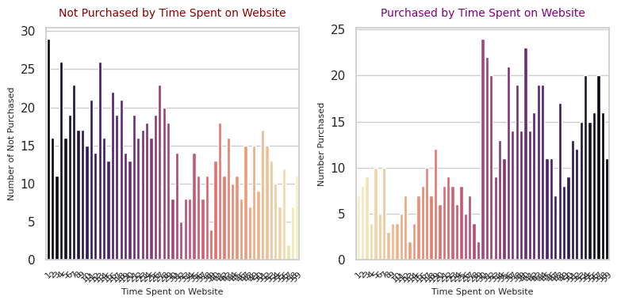

# Phase 1: Predicting Purchase Behavior with AI
Develop a predictive model to determine the likelihood of a customer making a purchase based on historical behavior and other demographic data, and analyze the features to learn how the variables impact purchase behavior. 

## Overview
Phase 1 of this project aims to familiarize myself with the data, create base models incorporating all features in the dataset, conduct feature importance on the variables impacting purchases,  eliminate unimpactful features, and explore additional research questions for phase 2.

## Dataset
### Predicting Customer Purchase Behavior
This dataset contains information on customer purchase behavior across various attributes, aiming to help understand the factors influencing purchase decisions. The .csv file can be found [**here.**](https://drive.google.com/file/d/16U50yowgGxdagBeJdFnO-f8FloBKS-Fs/view) 

* **All Features Used:** Age, Gender, AnnualIncome, NumberOfPurchases, TimeSpentOnWebsite, LoyaltyProgram, DiscountsAvailed, and ProductCategory
* **Target Variable:** PurchaseStatus (0: No, 1: Yes)

## Workflow
### Part 1: Data Exploration & Preprocessing
* **Loading Data:** `customer_purchase_data.csv` 
* **Encoding:** `ProductCategory` was one-hot encoded.
* **Feature Scaling:** Used `StandardScaler` for numerical features.
* **Exploratory Data Analysis (EDA):** Performed correlation analysis and visualized the distribution of the target variable.

### Part 2: Model Development
* **Data Split:** The data was split into training (80%) and testing (20%) sets.
* **Models Implemented:**
  * Logistic Regression
  * Decision Tree Classifier
  * Random Forest Classifier

### Part 3: Model Evaluation 
* Evaluated each model using specific metrics commonly used for binary classification to determine their performance.
* Compared model performance using confusion matrices and classification reports.

    
| Model              | Training | Accuracy | Precision | Recall | F1 Score | ROC AUC |
|--------------------|----------|----------|-----------|--------|----------|---------|
| LogisticRegression | 81.00%   | 84.00%   | 87.74%    | 72.66% | 79.49%   | 89.47%  |
| DecisionTree       | 90.42%   | 90.67%   | 89.06%    | 89.06% | 89.06%   | 94.01%  |
| RandomForest       | 100.00%  | 95.00%   | 98.29%    | 89.84% | 93.88%   | 95.80%  |

### Part 4: Feature Importance & Visualization
* Analyzed feature importance for the above models and created visualizations to highlight the most influential features, making it easier to communicate and understand insights.

### Part 5: Additional Exploration Questions
* To gather more insight into each feature and how they impact Purchase Status, sliced the df_oring into 2 separate dataframes **no_purchase_df** and **yes_purchase_df.**  Noteworthy insights are as follows: 
  * **yes_purchase_df.**
    * 75% who made a purchase spent 30 minutes or more on the website
    * 73% of those who made a purchase were 50 years old or younger
    * Over 50% of those who made a purchase were provided with 3 or more discounts
  * **no_purchase_df**
    * 64% of those who did not make a purchase spent less than 30 minutes on the website
    * 73% of those who did not make a purchase were 40 years old or older
    * Over 50% who did not make a purchase had 2 or less discounts availed.

## Results
### Model Performance Results
* **Random Forest Classifier** provided the best overall performance with high accuracy and balanced precision and recall. **Decision Tree Classifier** is a solid alternative, with slightly lower but balanced metrics. Finally, **Logistic Regression** underperforms, especially in recall and overall accuracy, making it the least effective of the three models.

### Feature Importance Results:
* **Important Features** Across Models: TimeSpentOnWebsite, Age, and DiscountsAvailed.
* **Least Important Features** Across Models: Gender, ProductCategory_1, ProductCategory_2, ProductCategory_3, and ProductCategory_4.

## Noteworthy Pain Points and Learning Experiences
* I realized after the fact that when I encoded Product Category  in **Step 2.1**, only four options were provided when there should have been 5.

## Opportunities for Further Research and Exploration in Phase 2
* Build and optimize additional predictive models using feature importance results obtained in Phase 1, eliminating features that scored lowest
* Explore questions derived in Part 5 of Phase 1, such as:
  * What are the factors influencing customer purchase decisions?
  * What factors contribute most to lead conversion?
  * How can we prioritize high-value leads?
  * How to segment customers based on interests, behavioral attributes, demographics, or stage in the journey? 

## License
This project is licensed under the [MIT License](../LICENSE.txt)

## Libraries Used:
Special thanks to the open-source community for providing these powerful tools.
* Pandas
* NumPy
* Matplotlib
* Seaborn
* Scikit-Learn
* Imbalanced-Learn
* XGBoost
* Plotly
* Dash

## Resources Consulted 
* AI Bootcamp, Models 11 -14. (2023). edX Boot Camps LLC
* This project took advantage of [Xpert Learning Assistant](https://bootcampspot.instructure.com/courses/6141/external_tools/313) to help with coding errors.
* This project utilized assistance from [ChatGPT](https://openai.com/chatgpt), an AI language model developed by OpenAI, for generating code snippets, explanations, and guidance.

## Contact
For any questions or suggestions, please contact **e.yanoshak@gmail.com** 