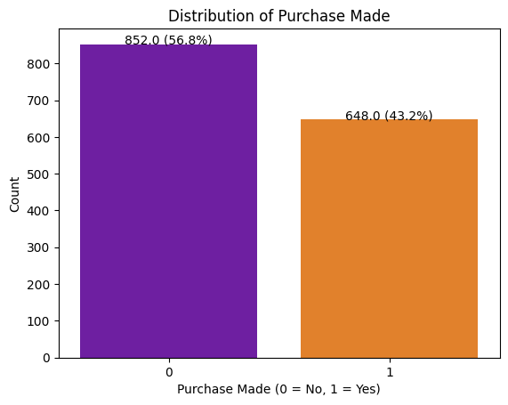
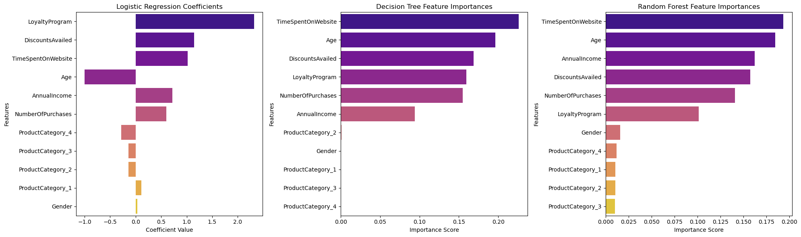
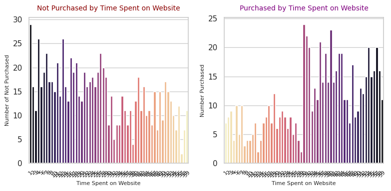
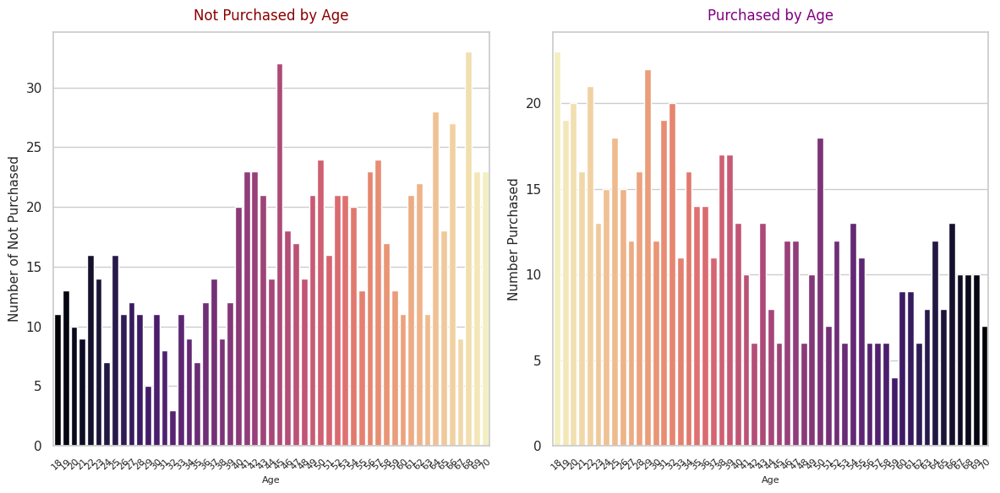
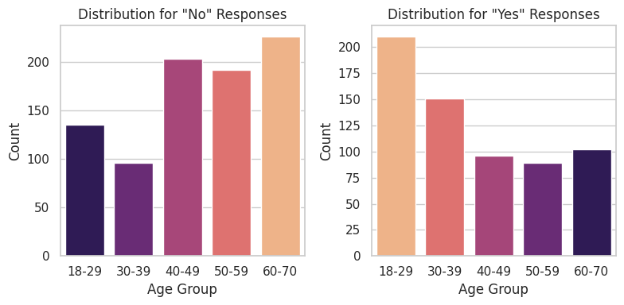
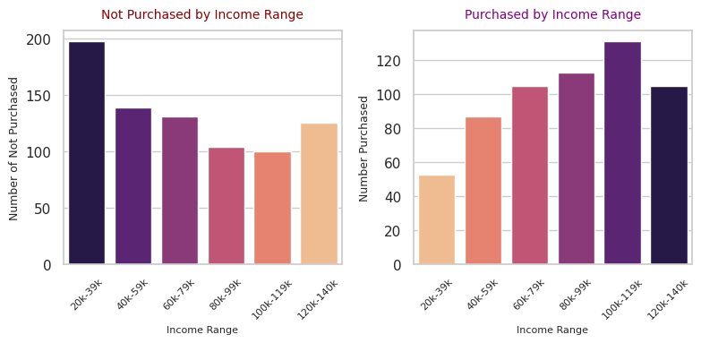
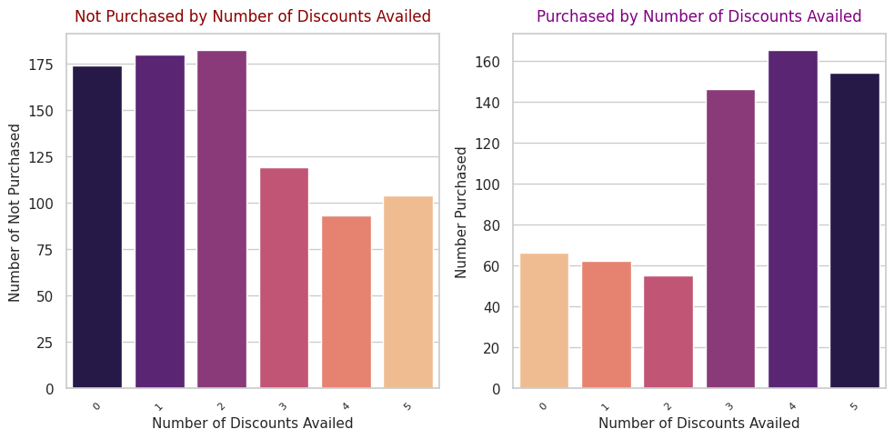
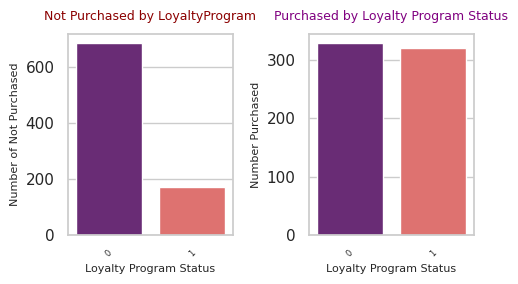

# Project 2 Phase 1

# Overview
Develop a predictive model to determine the likelihood of a customer making a purchase based on historical behavior and other demographic data, and analyze the features to learn how the variables impact customer purchase behavior. 

# Dataset
### Predicting Customer Purchase Behavior: *Exploring Consumer Trends & Unveiling Patterns*
This dataset contains information on customer purchase behavior across various attributes, aiming to help understand the factors influencing purchase decisions. The dataset includes demographic information, purchasing habits, and other relevant features. The .csv file can be found [**here.**](https://drive.google.com/file/d/16U50yowgGxdagBeJdFnO-f8FloBKS-Fs/view) 

# Installation
- Import modules:
    - import pandas as pd
    - import matplotlib.pyplot as plt
    - import seaborn as sns
    - from sklearn.model_selection import train_test_split
    - from sklearn.metrics import classification_report
    - from sklearn.preprocessing import StandardScaler
    - from sklearn.preprocessing import OneHotEncoder
    - from sklearn.linear_model import LogisticRegression
    - from sklearn.ensemble import RandomForestClassifier
    - from sklearn.metrics import accuracy_score
    - from sklearn import tree
    - from sklearn.metrics import confusion_matrix
    - from sklearn.metrics import ConfusionMatrixDisplay
    - from sklearn.linear_model import LinearRegression
    - from sklearn.metrics import mean_squared_error, r2_score
    - from sklearn.feature_selection import SelectFromModel
    - import numpy as np
    - from sklearn.metrics import accuracy_score, precision_score, recall_score, f1_score, roc_auc_score, roc_curve, confusion_matrix
    - import xgboost as xgb
    - from sklearn.tree import DecisionTreeClassifier

# Repository Files
## Phase 1
- [Phase 1 Notebook Folder:](../Phase_1)  
    - [Phase_1_ReadMe](../Phase_1/README1.md)
    - [Phase_1_ipynb](../Phase_1/Project2_Part1_final.ipynb)
    - [Phase 1 Image Folder](../Phase_1/Phase_1_images)

### Dataset Files
- [Predicting Customer Purchase Behavior Dataset](https://drive.google.com/file/d/16U50yowgGxdagBeJdFnO-f8FloBKS-Fs/view)
- [oring_df Dataframe](../Project_2_Files/oring_customer_purchase_data.csv)

### Presentation Files
- [Presentation in PDF form](../Project_2_Files/Project_2_Presentation.pdf)
- [Presentation in Google Powerpoint form](https://docs.google.com/presentation/d/1mbZxJYl2kmvrOtxgugkeUxmTGcqD68tFVBBpztCAZHs/edit?usp=sharing)

# Methodology

## Part 1: Data Exploration and Preprocessing

### Step 1: Load and Explore the Dataset
- Dataset was in excellent condition which was one of the reasons it was chosen. I read the dataset in, creating the original dataframe (df_oring) to conduct my initial exploration to narrow down a more detailed plan for this project.
   
#### 1.1 Understand the Structure of the Dataset
- After loading in the dataset I rounded all decimal points up in columns AnnualIncome and TimeSpentOnWebsite
- Checked the data types and the presence of missing values, ensuring there were none.
- Made a copy of the df_oring dataframe and saved it as df to us as a working model, ensuring the original df_oring stayed untouched for potential future purposes

### Step 2: Data Preprocessing
#### 2.1 Encoding Categorical Variables
- Used One-Hot Encoding for the categorical variableI 'ProductCategory' only, since there is no need for one-hot encoding for binary columns like 'Gender' and ‘LoyaltyProgram’
#### 2.2 Feature Scaling
- Scaled the numerical features in df to bring them to a similar range using StandardScaler, ensuring all features contribute equally to the model's performance.
#### 2.3 Exploratory Data Analysis (EDA)
- Conducted EDA to understand the relationships in the data, find the split to be 57% No Purchases and 43% Purchases

## Part 2: Training, Testing, Implementing, Evaluating and Comparing

### Step 3: Splitting the Dataset
- Defined the X (features) and y (targets) from the ‘df’” DataFrame, using all feature columns for this initial phase to get a feel for how the features impact the target.
- Divided dataset into Training and Testing sets  (80% training, 20% testing) to evaluate model performance effectively. 

### Step 4. Model Selection and Implementation 
- We'll use the following three models to predict whether a customer will make a purchase
  
#### 4.1 Logistic Regression
- Initialize the model, train the model, predict on the test set, and print the model training score and testing score

#### 4.2 Decision Tree
- Initialize the model, train the model, predict on the test set, and print the model training score and testing score

#### 4.3 Random Forest
- Initialize the model, train the model, predict on the test set, and print the model training score and testing score

### Step 5. Model Evaluation and Results Comparison 

#### 5.1 Model Evaluation
- Evaluated each model using specific metrics commonly used for binary classification to determine their performance.

#### 5.2 Comparing Model Performance
- Compared the evaluation metrics across different models to identify the best-performing one.
    - Defined a Function for Evaluation: To avoid repetitive code, I created a function that evaluates and prints the specific metrics used
 
| Model              | Training | Accuracy | Precision | Recall | F1 Score | ROC AUC |
|--------------------|----------|----------|-----------|--------|----------|---------|
| LogisticRegression | 81.00%   | 84.00%   | 87.74%    | 72.66% | 79.49%   | 89.47%  |
| DecisionTree       | 90.42%   | 90.67%   | 89.06%    | 89.06% | 89.06%   | 94.01%  |
| RandomForest       | 100.00%  | 95.00%   | 98.29%    | 89.84% | 93.88%   | 95.80%  |

#### 5.3 Model Performance Results
- Random Forest is the best model overall, offering the most balanced and highest performance across all metrics.
- Decision Tree is a solid alternative, with slightly lower but balanced metrics.
- Logistic Regression underperforms, especially in recall and overall accuracy, making it the least effective of the three models.

## Part 3: Feature Importance, Interpretation, and Visualizations 
- Understanding which features influence the model's predictions is crucial for actionable insights.

### Step 6. Feature Importance
#### 6.1 Logistic Regression Coefficients
- The coefficients indicate the relationship between each feature and the log-odds of the target variable.
- Interpretation:
    - Positive Coefficients: Features like AnnualIncome and DiscountsAvailed positively influence the likelihood of a purchase.
    - Negative Coefficients: Features like Age negatively influence the likelihood of a purchase.

#### 6.2 Decision Tree Feature Importances
- For Decision Trees, feature importance is derived from how much each feature contributes to reducing impurity.
  
#### 6.3 Random Forest Feature Importances
- For Random Forests, feature importance is derived from how much each feature contributes to reducing impurity.

### Step 7: Visualizing Feature Importances
- Visualizations enhance the interpretability of feature importances, making it easier to communicate insights.

#### 7.1 Interpreting Feature Importance Results:
- All three models resulted in the same 5 features being the least important: Gender, ProductCategory_1, ProductCategory_2, ProductCategory_3, and ProductCategory_4.

## Part 4: Additional Exploration Questions

### Step 8: Purchased vs Not Purchased  
To gather more insight into each feature and how they impact Purchase Status, sliced the df_oring into 2 separate dataframes **no_purchase_df** and **yes_purchase_df.**  Noteworthy insights are as follows: 

#### 8.1 Purchase Status by Time Spent on Website
- The majority of those who did not make a purchase spent less than 30 minutes on the website (64% vs. 36%), where the opposite can be said for those who did make a purchase with 75% spending 30 minutes or more on the website prior to their purchase.

#### 8.2 Purchase Status by Age
 - **Yes:** 73% of those who made a purchase were 50 years old or younger.
 - **Yes:** 58% of those who made a purchase were 40 years old or younger.
 - **No:** 73% of those who did not make a purchase were 40 years old or older. 

#### 8.3 Purchase Status by Income
 - **Yes:** 
 - **No:** 

#### 8.3 Purchase Status by Discounts Availed
 - Over 50% of those who made a purchase were provided with 3 or more discounts. Over 50% who did not make a purchase had 2 or less discounts availed.

#### 8.4 Purchase Status by Loyalty Program Participation
 - Loyal Program participation did not show to have an impact on those who did make a purchase as less than 50% who made a purchase were enrolled in the Loyalty Program. It does seem to impact those who did not make a purchased as 80% of those who did NOT make a  purchase, were not part of the Loyalty Program

# Noteworthy Pain Points and Learning Experiences
- I realized after the fact that when I encoded Product Category  in **Step 2.1**, only four options were provided when there should have been 5.

# Opportunities for Further Research and Exploration
I am hoping that Removing the features that scored lowest in feature importance will result in higher optimized models in Phase 2 as well provide additional insight on features with the highest importance on the target variable. 

# Resources Consulted 
- To complete this project, I relied heavily on class notes and activities, specifically focusing on weeks 11 - 14. 
- I also took advantage of **[Xpert Learning Assistant](https://bootcampspot.instructure.com/courses/6141/external_tools/313)** to help with coding errors.
- This project utilized assistance from [ChatGPT](https://openai.com/chatgpt), an AI language model developed by OpenAI, for generating code snippets, explanations, and guidance.
