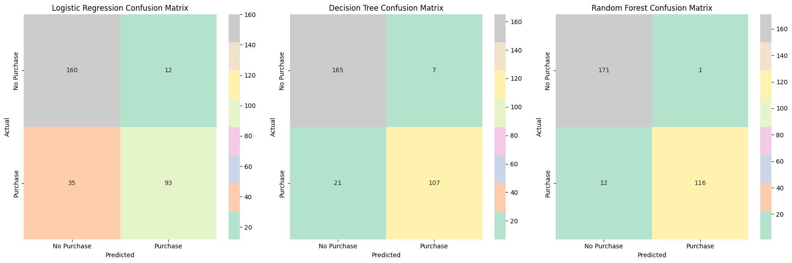
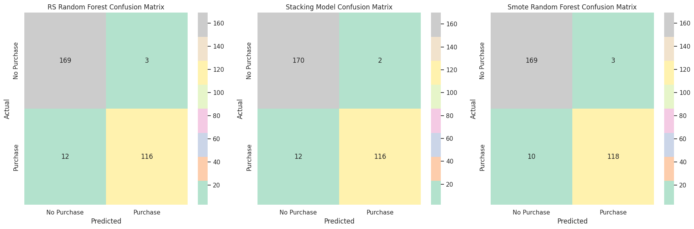
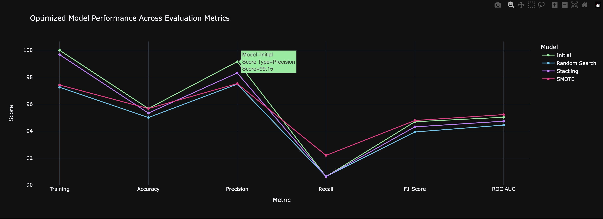
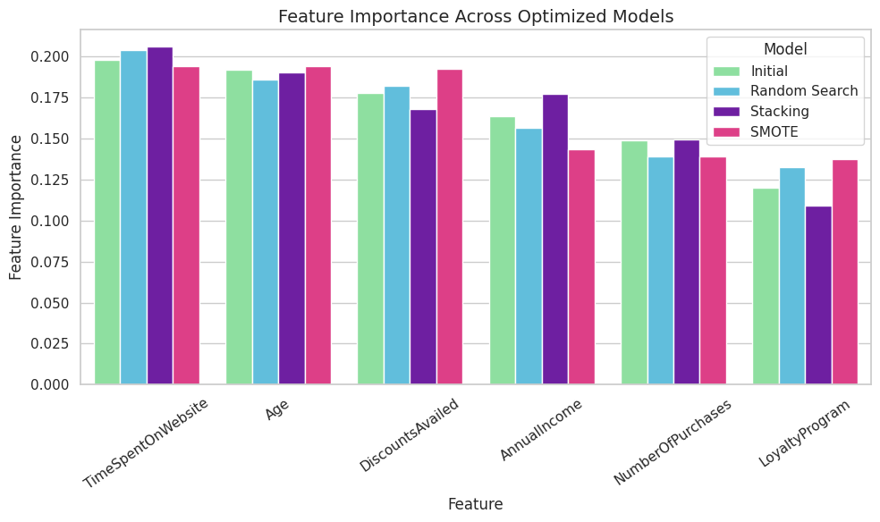
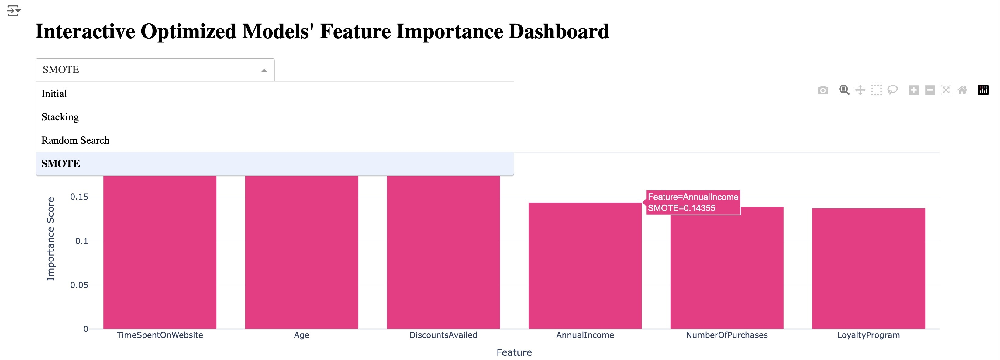
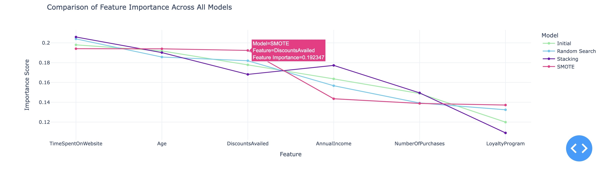

# Phase 2: Predicting Purchase Behavior with AI
This project focuses on predicting customer purchase behavior using machine learning models, with an emphasis on feature importance. It will highlight how to implement and optimize predictive models, offering marketers a framework to integrate AI-driven decision-making into their operations.

## Repository Files
### Phase 2
- [Phase 2 Notebook Folder:](../Phase_2)
    - [Phase 2 ReadMe](../Phase_2/Phase2_README.md)
    - [Phase_2_ipynb](../Phase_2/Project2_Phase2_Final.ipynb)
    - [Phase 2 Images](../Phase_2/Phase_2_images)
   
### [Dataset Files](../Phase_2/Dataset_Files)
- [Predicting Customer Purchase Behavior Dataset](../Phase_2/Dataset_Files/customer_purchase_data.csv)
- [oring_df Dataframe](../Phase_2/Dataset_Files/oring_customer_purchase_data.csv)

### [Presentation Files](../Phase_2/Presentation_Files)
- [Presentation in PDF form](../Phase_2/Presentation_Files/Project_2_Presentation.pdf)
- [Presentation in Google Powerpoint form](https://docs.google.com/presentation/d/1mbZxJYl2kmvrOtxgugkeUxmTGcqD68tFVBBpztCAZHs/edit?usp=sharing)


## Background
According to a recent study by HubSpot, 78% of marketers said their industry had changed more in the past three years than in the preceding five decades. It is easy to see why given an overwhelming majority, **95%**, of companies **now integrate AI-powered predictive analytics into their marketing strategy.** But the reality is while many companies tout the criticality of consumer data, from predicting future purchases to customer churn, 

> _**84% of marketing executives** report difficulty in making data-driven decisions despite all of the consumer data at their disposal._
>
> [Pecan.ai Predictive Analytics in Marketing Survey](https://venturebeat.com/ai/report-84-of-marketing-leaders-use-predictive-analytics-but-struggle-with-data-driven-decisions/)

## Overview
This project aims to guide marketers through the process of building and optimizing predictive models using consumer data to highlight which variables have the greatest impact. It will also showcase actionable insights derived from those models, such as specific customer segments to target or personalized marketing strategies, addressing questions such as: 
* What are the factors influencing customer purchase decisions?
* What factors contribute most to lead conversion?
* How can we prioritize high-value leads?
* How to segment customers based on interests, behavioral attributes, demographics, or stage in the journey? 

By bridging the gap between data collection and decision-making, the goal is to empower marketers to confidently integrate AI-driven insights into their day-to-day operations, ultimately improving customer engagement and ROI.


## Dataset
### Predicting Customer Purchase Behavior
The dataset includes demographic information, purchasing habits, and other relevant features. The .csv file can be found [**here.**](https://drive.google.com/file/d/16U50yowgGxdagBeJdFnO-f8FloBKS-Fs/view) 

* **Features Used:** Age, AnnualIncome, NumberOfPurchases, TimeSpentOnWebsite, LoyaltyProgram, DiscountsAvailed 
* **Target Variable:** PurchaseStatus (0: No, 1: Yes)

## Workflow
### **Part 1: Data Exploration and Preprocessing**
#### 1. Data Loading and Exploration
* Loaded the dataset and removed decimal points from `AnnualIncome` and `TimeSpentOnWebsite`
* Dropped irrelevant columns: `Gender` and `ProductCategory`, the features that scored lowest in importance in Phase 1
* Checked for missing values and data types

#### 2. Feature Scaling
* Scaled numerical features using `StandardScaler` to normalize the data, ensuring all features contribute equally to the model's performance

##### **Exploratory Data Analysis (EDA)**
* Analyzed the distribution of the target variable and generated a correlation matrix to understand feature relationships, finding the split to be **57% No Purchases** and **43% Purchases**

### **Part 2: Model Training and Evaluation**
#### 3. Data Splitting
* Split dataset into Training and Testing sets (80% training, 20% testing) to evaluate model performance effectively
  
#### 4. Model Selection and Implementation
* Used the same three models as Phase 1 to predict whether a customer will make a purchase
  * Logistic Regression
  * Decision Tree Classifier
  * Random Forest Classifier

#### 5. Model Evaluation and Comparison
* Evaluated each model using specific metrics commonly used for binary classification to determine their performance.

##### **Comparing Model Performance**
* Compared the evaluation metrics across different models to identify the best-performing one

 
|  Score Type |  Logistic Regression |  Decision Tree |  Random Forest |
|:-----------:|:--------------------:|:--------------:|:--------------:|
| Training    | 0.8192               | 1              | 1              |
| Accuracy    | 0.8433               | 0.9067         | 0.9567         |
| Precision   | 0.8857               | 0.9386         | 0.9915         |
| Recall      | 0.7266               | 0.8359         | 0.9062         |
| F1 Score    | 0.7983               | 0.8843         | 0.9469         |
| ROC AUC     | 0.8284               | 0.8976         | 0.9502         |


##### **Model Performance Results**



* **Random Forest** performs best given it achieves the highest scores across all key metrics—accuracy, precision, F1 score, and ROC AUC—indicating it strikes the best balance between making correct predictions and avoiding both false positives and false negatives. **Decision Tree** performs reasonably well, and similar to Phase 1, **Logistic Regression** performs the worst


### **Part 3: Model Optimization and Enhancement**
#### 6. Model Optimization
* Since Random Forest performed the best, I applied the following strategies to improve its predictive performance on customer purchase behavior
##### **Hyperparameter Tuning**
* Used RandomizedSearchCV for optimizing the Random Forest model's hyperparameters
##### **Ensemble Method Stacking**
* Implemented a Stacking Classifier combining Random Forest and Logistic Regression as base learners
##### **Class Imbalance Handling**
* Applied SMOTE (Synthetic Minority Over-sampling Technique) to the optimized Random Search model to address class imbalance
  
#### 7. Performance Evaluation

Compared optimized models against each other as well as the initial Random Forest Model prior to optimization

##### **Optimized Model Scores**

| Score Type | Training  | Accuracy | Precision | Recall | F1 Score | ROC AUC |
|------------|:---------:|:--------:|:---------:|:------:|:--------:|:-------:|
| Initial    | 100.00%   | 95.67%   | 99.15%    | 90.62% | 94.69%   | 95.02%  |
| Rd Search  | 97.25%    | 95.00%   | 97.48%    | 90.62% | 93.93%   | 94.44%  |
| Stacking   | 99.67%    | 95.33%   | 98.31%    | 90.62% | 94.31%   | 94.73%  |
| SMOTE      | 97.42%    | 95.67%   | 97.52%    | 92.19% | 94.78%   | 95.22% |


##### **Optimized Model Scores Comparisons**
* Visualized results with side-by-side confusion matrices and performance plots
\


##### **Optimized Models Interactive Line Plot**
* Created an interactive line plot for a more dynamic and user-friendly way to explore and compare metric scores across the Optimized Models.
* Using the Plotly library, which allows for features such as tooltips, zooming, and panning, first I installed Plotly:
```
pip install plotly
```
* Then I defined the data, created and melted the dataframe and defined a color map for each model. Finally I created the interactive line plot with custom colors using the following code:
```
fig = px.line(df_melted,
              x='Score Type',
              y='Score',
              color='Model', # Differentiates each model by color to easily compare metrics across models
              markers=True, # Adds markers at each data point to easily interact with individual scores.
              title='Optimized Model Performance Across Evaluation Metrics',
              color_discrete_map=color_map)
```



* The x-axis represents the specific metrics used to evaluate the models. The y-axis represents the numerical score of each metric.
* Each line represents a different model (Initial, Stacking, Random Search, SMOTE), and one can interact with the plot by hovering, zooming, and selecting or deselecting specific models.

### **Part 4: Feature Importance and Visualizations**
#### 8. Feature Importance Analysis
* Identified the most significant features influencing the target variable of each optimized as well as the initial model.

| Feature               | Initial  | Stacking | Rd  Search | SMOTE    |
|-----------------------|:--------:|:--------:|:----------:|:--------:|
| Time Spent on Website | 0.197975 | 0.205891 | 0.203998   | 0.194094 |
| Age                   | 0.191828 | 0.190175 | 0.185685   | 0.193980 |
| Discounts             | 0.177785 | 0.168159 | 0.181936   | 0.192347 |
| Annual Income         | 0.163607 | 0.177235 | 0.156703   | 0.143550 |
| # of Purchases        | 0.148878 | 0.149491 | 0.139254   | 0.138833 |
| Loyalty Program       | 0.119926 | 0.10905  | 0.132424   | 0.137196 |


##### **Visualizing Feature Importances**
* Created various plots to display feature importances across different models.



#### 9. Interactive Dashboard for Feature Importance Using Plotly Dash
* Developed an interactive dashboard (Dash App) that updates in real-time with dropdown filters and sliders using Plotly and Dash to visualize feature importance across optimized models for in-depth analysis. Highlights include:
  * **Dropdown filter:** The app allows users to select a model (e.g., Initial, Stacking, Random Search, SMOTE) from the dropdown, and the corresponding bar plot below updates in real-time.
  * **Interactive dashboard:** Makes it easy to explore how feature importance varies across models with just a few clicks.
  * **Customization:** Easily further enhance the dashboard by adding more visualizations, sliders, or filters.




## Installation
Ensure you have the following libraries installed:
  * `pip install pandas numpy matplotlib seaborn scikit-learn imbalanced-learn xgboost plotly dash`

### Usage
https://github.com/EricaYanoshak/AI-Purchase-Behavior-Project/tree/main?tab=readme-ov-file
1. Clone the Repository: `git clone https://github.com/EricaYanoshak/AI-Purchase-Behavior-Project`
2. Navigate to the Project Directory: `cd AI-Purchase-Behavior-Project`
3. Run the Notebook or Script: `Project2_Phase2_Final.ipynb`
  * If using Jupyter Notebook: `jupyter notebook Project2_Phase2_Final.ipynb`
  * If using a Python script: `python Project2_Phase2_Final.py`

## Results, Insights and Next Steps
### Optimized Models 
The optimized **Random Forest** Classifier after **hyperparameter tuning** and **SMOTE application**, SMOTE model, offers the best balance across all metrics, particularly in recall, F1 score, and ROC AUC. It’s especially suitable for scenarios where identifying positive cases (e.g., customers likely to make a purchase) is crucial. The Stacking Model also performs well but focuses slightly more on precision.

### Feature Importance 
The most important predictors of customer purchase behavior are **Time Spent on Website**, **Age**, and **Discounts Availed**. Models that address class imbalance (like SMOTE) tend to place higher importance on discounts and loyalty programs. Understanding these key drivers can help businesses target marketing strategies to improve conversion rates.

1. **Time Spent on Website:** consistently **the most important feature** across all models, indicating it is a significant predictor of purchase behavior.
2. **Age:** consistently ranked as the **second most important**, highlighting its key role in determining purchasing behavior.
3. **Discounts Availed:** results suggests that discounts **heavily impact** purchasing decisions, especially when class imbalance is addressed (SMOTE).
4. **Annual Income:** shows a **moderate impact** across **all models**, suggesting it affects purchasing behavior, but to a lesser extent 
5. **Number of Purchases:** shows lower importance across all models
6. **Loyalty Program:** has the lowest importance across models, indicating that while it is a factor, it is not a strong determinant of purchasing behavior.


### Insights for Marketing Teams
* **Focus on Website Engagement:** Given that Time Spent on Website is the most important predictor, marketing efforts should focus on increasing time spent on the site. Consider personalized content, interactive features, and optimized user experiences.
* **Target Age Segments:** Tailor marketing strategies based on the Age of the target audience. Younger audiences may prefer social media ads, while older demographics may respond to email or loyalty programs.
* **Discount Promotions:** Emphasize Discounts in marketing campaigns, especially for customers with high web engagement but lower purchase conversion.

### Next Steps for Further Testing
The below steps can help refine the model further, ensuring that it is both predictive and useful for business applications.
* **Additional Hyperparameter Tuning:** Explore finer adjustments in the hyperparameters for Random Search and SMOTE models to improve their predictive performance. This includes testing a broader range of values for estimators, max depth, and learning rates.
* **Feature Engineering:** Investigate interactions between features (e.g., Age * Time Spent on Website) to improve predictive power.
* **Sensitivity Analysis:** Test the models' sensitivity to different ranges of feature values (e.g., high-income versus low-income groups) to better understand how feature importance shifts across different customer segments.
* **Evaluate Different Resampling Techniques:** Given the SMOTE model results, it would be beneficial to explore alternatives to SMOTE, such as ADASYN or NearMiss, to handle class imbalance differently and assess the impact on model performance.
* **External Data Sources:** If possible, incorporate external data (e.g., social media activity, geographic information) to see if other features improve predictions.

## Conclusion
This project successfully predicts customer purchase behavior using optimized machine learning models. The Random Forest model, after hyperparameter tuning and addressing class imbalance, performed the best. The Feature Importance analysis provided actionable insights for marketers.

The interactive dashboard offers a clear way to visualize feature prioritization, helping data scientists and stakeholders make informed decisions in real time. While quick to implement, models require time to fully optimize, and the quality of results depends on the data provided, this project can serve as a model to better understand and implement predictive models for immediate insights. Marketers who embrace predictive modeling will be well-positioned to thrive in the ever evolving landscape.

## Noteworthy Pain Points and Learning Experiences
Throughout this project, several challenges emerged. Initially, I underestimated the dataset's class imbalance, which would have benefited from using SMOTE right after splitting the data to balance the training set. Additionally, I missed an opportunity to perform feature engineering on high-performing columns, like multiplying Time Spent on Website by Discounts Availed. Furthermore, due to time constraints, I couldn't fully retest and refine the model based on feature importance results, which could have enhanced performance further. And lastly, collaboration and attention to detail were also crucial learning points.

## License
This project is licensed under the [MIT License](../LICENSE.txt)

## Libraries Used:
Special thanks to the open-source community for providing these powerful tools.
* Pandas
* NumPy
* Matplotlib
* Seaborn
* Scikit-Learn
* Imbalanced-Learn
* XGBoost
* Plotly
* Dash

## Contact
For any questions or suggestions, please contact **e.yanoshak@gmail.com** 

## Resources Consulted 
* [_State of Marketing & Trends Report_](https://drive.google.com/file/d/16EYixKtznw8tAVgD28nj2mSR_qNYmZWm/view?usp=sharing). (2024). Hubspot
* [_State of Predictive Analytics in Marketing_](https://www.pecan.ai/resource/state-of-predictive-analytics-marketing-2022/). (Sept. 2022). Pecan.ai 
* [_Predict Customer Purchase Behavior Dataset_](www.kaggle.com/datasets/rabieelkharoua/predict-customer-purchase-behavior-dataset). (2024, June 19). Kaggle
* [_Predictive Analytics Market Size, Share & Industry Analysis_](https://www.fortunebusinessinsights.com/predictive-analytics-market-105179). (Sept. 2, 2024). Fortune Business Insights
* AI Bootcamp, Models 11 -14. (2023). edX Boot Camps LLC

## Acknowledgements
* Special thanks to Julia Kim, the best professor I've ever had and to whom I would not have had the confidence to complete this project on my own had it not been for her belief in me
* Anthony Inthavong, amazing TA, for his assistance in Github and ReadMe issues 
* This project took advantage of [Xpert Learning Assistant](https://bootcampspot.instructure.com/courses/6141/external_tools/313) to help with coding errors.
* This project utilized assistance from [ChatGPT](https://openai.com/chatgpt), an AI language model developed by OpenAI, for generating code snippets, explanations, and guidance.


