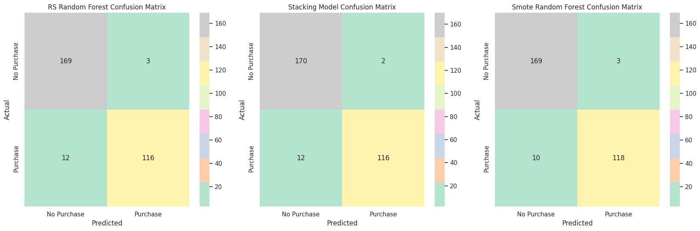
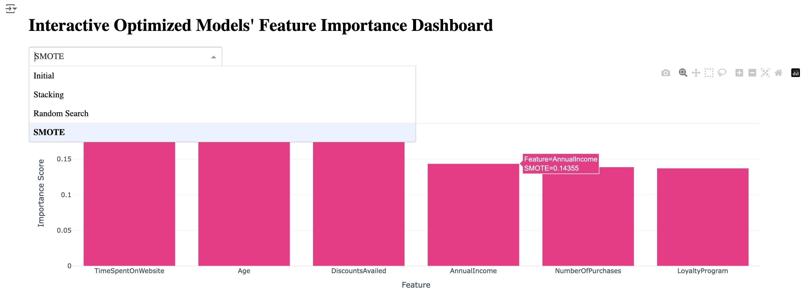
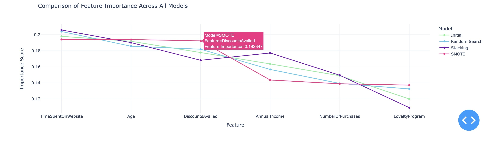

# Project 2 Phase 2

# Overview
Develop a predictive model to determine the likelihood of a customer making a purchase based on historical behavior and other demographic data, and analyze the features to learn how the variables impact customer purchase behavior. 

# Dataset
### Predicting Customer Purchase Behavior: *Exploring Consumer Trends & Unveiling Patterns*
This dataset contains information on customer purchase behavior across various attributes, aiming to help understand the factors influencing purchase decisions. The dataset includes demographic information, purchasing habits, and other relevant features. The .csv file can be found [**here.**](https://drive.google.com/file/d/16U50yowgGxdagBeJdFnO-f8FloBKS-Fs/view) 

# Installation
- Import modules:
    - import pandas as pd
    - import matplotlib.pyplot as plt
    - import seaborn as sns
    - from sklearn.model_selection import train_test_split
    - from sklearn.metrics import classification_report
    - from sklearn.preprocessing import StandardScaler
    - from sklearn.preprocessing import OneHotEncoder
    - from sklearn.linear_model import LogisticRegression
    - from sklearn.ensemble import RandomForestClassifier
    - from sklearn.metrics import accuracy_score
    - from sklearn import tree
    - from sklearn.metrics import confusion_matrix
    - from sklearn.metrics import ConfusionMatrixDisplay
    - from sklearn.linear_model import LinearRegression
    - from sklearn.metrics import mean_squared_error, r2_score
    - from sklearn.feature_selection import SelectFromModel
    - import numpy as np
    - from sklearn import tree
    - from sklearn.metrics import accuracy_score, precision_score, recall_score, f1_score, roc_auc_score, roc_curve, confusion_matrix
    - import xgboost as xgb
    - from sklearn.tree import DecisionTreeClassifier
    - from imblearn.over_sampling import SMOTE
    - from sklearn.ensemble import RandomForestClassifier
    - from sklearn.model_selection import GridSearchCV
    - from sklearn.model_selection import RandomizedSearchCV
    - from scipy.stats import randint
    - from sklearn.ensemble import StackingClassifier
    - from sklearn.linear_model import LogisticRegression
    - from sklearn.feature_selection import SelectFromModel
    - pip install plotly
    - import plotly.express as px

# Repository Files
## Phase 2
- [Phase 2 Notebook Folder:](../Phase_2)
    - [Phase 2 ReadMe](../Phase_2/README2.md)
    - [Phase_2_ipynb](../Phase_2/Project2_Phase2_Final.ipynb)
    - [Phase 2 Images](../Phase_2/Phase_2_images)
   
### Dataset Files
- [Predicting Customer Purchase Behavior Dataset](https://drive.google.com/file/d/16U50yowgGxdagBeJdFnO-f8FloBKS-Fs/view)
- [oring_df Dataframe](../Project_2_Files/oring_customer_purchase_data.csv)

### Presentation Files
- [Presentation in PDF form](../Project_2_Files/Project_2_Presentation.pdf)
- [Presentation in Google Powerpoint form](https://docs.google.com/presentation/d/1mbZxJYl2kmvrOtxgugkeUxmTGcqD68tFVBBpztCAZHs/edit?usp=sharing)

# Methodology

## Part 1: Data Exploration and Preprocessing

### Step 1: Load and Explore the Dataset
- First, I load the dataset using Pandas and explore its structure.
   
#### 1.1 Understand the Structure of the Dataset
- First I loaded the working, cleaned dataset from Phase 1, df_oring.  
- After ensuring there were no missing values, I made a copy of the df_oring data frame, removing the Gender and Product_Catogory features that scored lowest in feature importance in phase 1

### Step 2: Data Preprocessing
#### 2.1 Feature Scaling
- Scaled the numerical features in df to bring them to a similar range using StandardScaler, ensuring all features contribute equally to the model's performance.
#### 2.2 Exploratory Data Analysis (EDA)
- Conducted EDA to understand the relationships in the data, find the split to be 57% No Purchases and 43% Purchases

## Part 2: Training, Testing, Implementing, Evaluating and Comparing

### Step 3: Splitting the Dataset
- Defined the X (features) and y (targets) from the ‘df’” DataFrame, using only the features that scored highest in feature importance from Phase 1, which consisted of: Age, AnnualIncome, NumberOfPurchases, TimeSpentOnWebsite, and DiscountsAvailed.
- Divided dataset into Training and Testing sets  (80% training, 20% testing) to evaluate model performance effectively. 

### Step 4. Model Selection and Implementation 
- We'll use the same three models used in Phase 1 to predict whether a customer will make a purchase
  
#### 4.1 Logistic Regression
- Initialize the model, train the model, predict on the test set, and print the model training score and testing score

#### 4.2 Decision Tree
- Initialize the model, train the model, predict on the test set, and print the model training score and testing score

#### 4.3 Random Forest
- Initialize the model, train the model, predict on the test set, and print the model training score and testing score

### Step 5. Model Evaluation and Results Comparison 

#### 5.1 Model Evaluation
- Evaluated each model using specific metrics commonly used for binary classification to determine their performance.

#### 5.2 Comparing Model Performance
- Compared the evaluation metrics across different models to identify the best-performing one.
    - Defined a Function for Evaluation: To avoid repetitive code, I created a function that evaluates and prints the specific metrics used
 
|  Score Type |  Logistic Regression |  Decision Tree |  Random Forest |
|:-----------:|:--------------------:|:--------------:|:--------------:|
| Training    | 0.8192               | 1              | 1              |
| Accuracy    | 0.8433               | 0.9067         | 0.9567         |
| Precision   | 0.8857               | 0.9386         | 0.9915         |
| Recall      | 0.7266               | 0.8359         | 0.9062         |
| F1 Score    | 0.7983               | 0.8843         | 0.9469         |
| ROC AUC     | 0.8284               | 0.8976         | 0.9502         |

#### 5.3 Model Performance Results

- **Random Forest** performs best given it achieves the highest scores across all key metrics—accuracy, precision, F1 score, and ROC AUC—indicating it strikes the best balance between making correct predictions and avoiding both false positives and false negatives. 
- **Decision Tree** performs reasonably well, especially in recall (83.59%) and overall accuracy (90.67%), but it doesn't match Random Forest's precision and overall balance between metrics.
- Similar to Phase 1, **Logistic Regression** performs the worst, especially in recall (72.66%) and F1 score (79.83%), showing it struggles to capture true positives compared to the other models.

Therefore Random Forest will be used for the next part, optimizing the model.

The <mark>properties</mark> of the noble gases can be well explained by modern theories of atomic structure: Their <mark>outer shell of valence electrons</mark> is 

## Part 3: Model Optimization, Evaluation and Visualization Results  

### Step 6. Model Optimization
- Since Random Forest performed the best, I used the following strategies to improve its predictive performance on customer purchase behavior.
#### 6.1 Hyperparameter Tuning
- To systematically explore a range of hyperparameters for the Random Forest model, first I employed Random Search as it is an efficient approach that samples random combinations of hyperparameters and is particularly useful when the parameter grid is large.
#### 6.2 Ensemble Method Stacking
- Chosen for its model diversity as each base model (e.g., Random Forest and Logistic Regression) have the potential to capture different patterns in the data. By combining them, the ensemble can potentially reduce the risk of overfitting to specific patterns that a single model might focus on.
#### 6.3 Class Imbalance Handling
- SMOTE (Synthetic Minority Over-sampling Technique) was used due to its ability to help optimize a model's ability to correctly classify the minority class by addressing the imbalance, which can lead to a more reliable and accurate model.

### Step 7: Model Optimization Evaluation

#### 7.1 Optimized Model Scores

| Score Type | Training  | Accuracy | Precision | Recall | F1 Score | ROC AUC |
|------------|:---------:|:--------:|:---------:|:------:|:--------:|:-------:|
| Initial    | 100.00%   | 95.67%   | 99.15%    | 90.62% | 94.69%   | 95.02%  |
| Rd Search  | 97.25%    | 95.00%   | 97.48%    | 90.62% | 93.93%   | 94.44%  |
| Stacking   | 99.67%    | 95.33%   | 98.31%    | 90.62% | 94.31%   | 94.73%  |
| SMOTE      | 97.42%    | 95.67%   | 97.52%    | 92.19% | 94.78%   | **95.22%** |

#### 7.2 Optimized Model Scores Comparisons

#### 7.3 Optimized Model Results
- While all models perform similarly, **SMOTE** performs best overall, particularly in handling class imbalance, with superior recall, F1 score, and ROC AUC. Its ability to generate synthetic minority class examples helps ensure balanced training, leading to better model performance in imbalanced scenarios.
- The **Stacking** model performs well in terms of precision and generalization but doesn’t handle the minority class as effectively as SMOTE, making it slightly less suitable in class imbalance scenarios. Overall, it is a strong performer but not the top choice when dealing with imbalanced datasets.
- **Random Search** is good at optimizing hyperparameters but it does not handle class imbalance effectively, leading to suboptimal performance, especially in terms of minority class recall and F1 score. 

#### 7.4 Interactive Line Plot
- Created an interactive line plot to interact with optimized model performance across evaluation metrics.

## Part 4: Optimized Model Feature Importance, Interpretation, and Visualizations 

### Step 8: Visualizing Feature Importances
- 8.1 Initial Random Forest Model Feature Importance
- 8.2 Optimized Random Search Model Feature Importance
- 8.3 Optimized Stacking Model Feature Importance
- 8.4 Optimized SMOTE Model Feature Importance

### Step 9: Comparing Feature Importances across Optimized Models 

#### 9.1 Feature Importance Across Optimized Models

#### 9.2 Interactive Line Plot
- Created an interactive line plot to interact with optimized model performance across Feature Importance scores.

#### 9.3 Interactive Dashboard for Feature Importance Using Plotly Dash
Created an interactive dashboard (Dash App) that updates in real-time with dropdown filters and sliders using Plotly Dash to visualize feature importance across optimized models. Highlights include:
- **Dropdown filter:** The app allows users to select a model (e.g., Initial, Stacking, Random Search, SMOTE) from the dropdown, and the corresponding bar plot below updates in real-time.
- **Interactive dashboard:** Makes it easy to explore how feature importance varies across models with just a few clicks.
- **Customization:** Easily further enhance the dashboard by adding more visualizations, sliders, or filters.

#### 9.4 Feature Importance Across Optimized Models: Insights and Conclusions
##### Insights:
- **_Time Spent on Website_** and **_Age_** are the most important features in predicting outcomes across all models, showing strong predictive power.
- The **Stacking Model** seems to emphasize **_Annual Income_** and downplays **_Discounts Availed_** and **_Loyalty Program._**  
- **Random Search** slightly reduces the importance of features like **_Age_** and **_Loyalty Program_** compared to **Initial** and **SMOTE models**.
- **SMOTE** retains similar importance to the **Initial model** for all features, suggesting it doesn't drastically shift feature importance but rather balances class predictions.

##### Conclusions:
- **Time Spent on Website** is consistently the top feature, while Stacking and Random Search provide nuanced changes in how other features are weighted.
- The **Stacking model** highlights **_Annual Income_** more strongly, while **_Discounts Availed_** is less influential compared to the **Initial model**. The **SMOTE model** maintains similar importance values as the **Initial**, indicating that its main impact is on balancing class predictions rather than altering feature importance.

# Noteworthy Pain Points and Learning Experiences
There were many pain points and learning experiences throughout this project. The first would be to ensure that I had a supportive team member who also contributed to this project. I also made an incorrect calculation in the beginning of this project thinking that the class imbalance of my dataset was  not as large as it was. In hindsight, I should have used SMOTE immediately after  I split the data into training and testing sets so I could evaluate the model performance on unseen data and create a more balanced training set prior to testing. I also should have completed feature engenering between some of the high performing columns such as multiplying time on website by Discounts Availed.

# Opportunities for Further Research and Exploration
1. **Prioritize Website Engagement in Campaigns:**
    - *Time Spent on Website* is the most important feature across all models, suggesting that customers who spend more time on the website are more likely to make a purchase. Marketing teams should focus on strategies to increase website engagement, such as improving the user experience, creating engaging content, or offering incentives for staying on the site longer.
2. **Leverage Demographics for Personalization:**
    - Since *Age* is consistently one of the top features, marketing teams should consider demographic segmentation when designing campaigns. Tailor marketing efforts and offers to different age groups based on their behavior and preferences.
3. **Optimize Discount Offers Strategically:**
    - While *Discounts Availed* is important, its relevance decreases in the stacking model. Marketing teams should test and evaluate the effectiveness of discount campaigns to ensure they are targeted at the right audience, focusing on those who are more price-sensitive.
4. **Test and Implement Feature-Based Campaigns:**
    - Based on feature importance insights, marketing teams should A/B test targeted campaigns focusing on the most influential features. For instance, running targeted ads for high-value customers who spend more time on the website or personalizing offers based on age and income can drive more purchases.
5. **Continuous Monitoring and Optimization:**
    - Use the insights from feature importance regularly to adjust marketing strategies. As customer behaviors shift over time, revisit the predictive model and optimize it based on current data trends. This will help keep campaigns relevant and maximize conversion rates.
6. **Refine Marketing Automation:**
    - Integrate the predictive model into marketing automation tools to automatically segment customers and personalize messages based on the likelihood of making a purchase. Use the top features to trigger personalized email marketing, retargeting ads, or in-app messages that align with the behavior and demographic of customers.

# Resources Consulted 
- To complete this project, I relied heavily on class notes and activities, specifically focusing on weeks 11 - 14. 
- I also took advantage of [Xpert Learning Assistant](https://bootcampspot.instructure.com/courses/6141/external_tools/313) to help with coding errors.
- This project utilized assistance from [ChatGPT](https://openai.com/chatgpt), an AI language model developed by OpenAI, for generating code snippets, explanations, and guidance.

The <mark>properties</mark> of the noble gases can be well explained by modern theories of atomic structure: Their <mark>outer shell of valence electrons</mark> is 

**This is in bold, _italics_, ~~and strikethrough~~**

What factors contribute most to lead conversion?
How can we prioritize high-value leads?

